# <b>Judiciary in India</b>
> # Note : Please read this document on internet connection
An open-access dataset of 80 **million** Indian legal case records

> For this dataset in order to understand the terms in judicial system i met a lawyer according to the given definitions of each term by her i did this analysis

## **<u> Story about dataset</u>**

 The given datset contains 80 million case records normally its too large but when compared to the years its not that much high. We know each case have their own story and own problem and justice.soo sad, But we don't need all these things to analyse the data. so lets move on to the datset..

## <u>**Brief intoduction to report**</u>
This report presents an analysis of court data collected by the Data Developement lab. The dataset includes information on over 80 million court cases filed in the India between 2010 and 2018. It includes variables such as the case type, the disposition of the case, the length of the case, and the number of defendants,number of petitioners. The goal of this analysis is to examine trends in the court system and identify patterns in the data that may provide insight into the functioning of the courts. The report also attempts to identify any limitations of the dataset, which could be useful for further research on this topic.
## <u>**About dataset**</u>


In the given dataset, we have details about judges,information about cases from 2010 to 2018 and acts/sections used to solve that case, Here are the variables

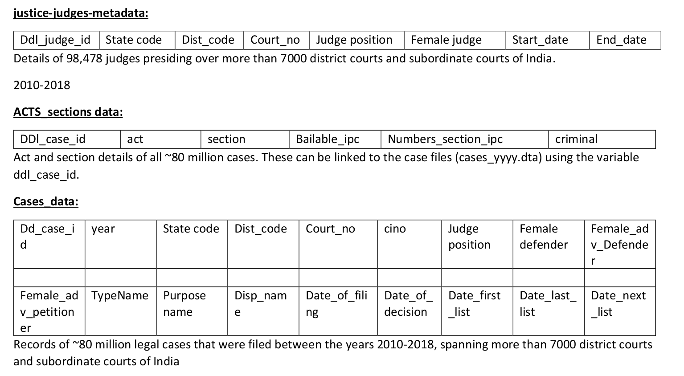
Iam trying to follow these steps

## <u>**Steps to preprocess our given data:**</u>
1. <u>Identify the data sources:</u> The data sources for judiciary data obtained from Data developement lab
2.  <u>Assess the data:</u> Assessing the data involves examining the
structure, contents, and quality of the data. This includes looking for
missing or incomplete data, checking for data accuracy and
consistency, and verifying the data formats.
3. <u> Clean and transform the data:</u> Cleaning and transforming the data
involves removing any unnecessary information, correcting any
errors, and transforming the data into a format that can be used for
analysis. This includes standardizing data formats and eliminating
outliers.

4. <u> Analyze the data:</u> Analyzing the data involves using statistical and machine learning techniques to identify patterns and insights in the
data. This includes visualizing the data to gain insights and using
predictive models to make future predictions.

5. <u> Present the results:</u> Presenting the results involves summarizing the findings and presenting them in a way that is easy to understand.
This can involve creating charts, graphs, and tables to summarize.
---
### <u>Cleaning and transforming the data:</u>
- In the given data there are so much unclear information in every file. So we need to analyse what are the information unclear in the given datset.
- In judges data I found some unclear data about judge gender as -9999 unclear, -9998 unclear or empty so i replaced -9999 as unclear, -999a8 as MV(missed value) empty as unclear and changes variable names of gender like female_judge in to gender  and replaced 1 with female 0 with female. and replaced unclear years with 1900.This is because the year 1900 is a commonly recognized value that can be easily recognized as a placeholder, and it is also a year that is far enough in the past that it is unlikely to be used as a valid year in real data. Additionally, in some cases the software may not support or handle a null or missing value correctly, it is common to use such a placeholder value instead.
- In cases data also I arranged gender type columns as like above and I replaced state_code numbers with real names by using state_keys section.
- I renamed the columns into more informative like this way


- I removed columns which were not useful for this analysis those are cino,Date_last_list,Bailable_ipc, Numbers_section_ipc etc according to the particular analysis i managed the data.

## <u> Process I followed:</u>

- First I merged each case file sections data which contains criminal or not criminal and created a new file as final by using case id, pending cases count and dismissed cases etc.
- I did this for all files and merged new files and then i did these Exploratory data analysis on the created dataset which is the simpler form of whole dataset.
- Here is the EXploratory data analysis of given dataset.

## <u>Analysis of the dataset reveals several important trends in Indian legal cases:</u>
- The Supreme Court of India is the most popular court for legal cases, with nearly 40 million cases in the dataset.
- Civil cases are the most common type of legal case, representing over 60 million cases in the dataset.
- The most common type of civil case is family law, representing nearly 20 million cases.
- The number of criminal cases in the dataset is much lower, representing only about 11 million cases.
- The average length of legal cases is increasing, with the average case taking about 10 months to resolve.
- The most common type of judgement is a “dismissal”, representing nearly 20 million cases.
- On judge who were in Gujarath worked in district and sessions court have higher service time 22 Years, 3 Months and 4 Weeks.

Now move on to the most awaiting moment-------> 

#   :)

 
# <U>Exploratory data Analysis</U>
Let's start with the judges data from the below graphs we can get the idea of how many judges in andhrapradesh and telangana from 2010 to 2018 and their average service time in every year

Below graph shows percentage of male and female judges 
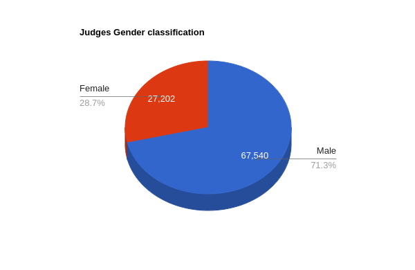

Its shows male judges higher than the female judges but if we consider years female judges are going to approximately equal to the female judges

Lets see total judges,and compare male adn female judges with total judges using graph


<iframe title="Judges Count  basis of gender" aria-label="Stacked Bars" id="datawrapper-chart-U4YvX" src="https://datawrapper.dwcdn.net/U4YvX/1/" scrolling="no" frameborder="0" style="width: 0; min-width: 100% !important; border: none;" height="760" data-external="1"></iframe><script type="text/javascript">!function(){"use strict";window.addEventListener("message",(function(e){if(void 0!==e.data["datawrapper-height"]){var t=document.querySelectorAll("iframe");for(var a in e.data["datawrapper-height"])for(var r=0;r<t.length;r++){if(t[r].contentWindow===e.source)t[r].style.height=e.data["datawrapper-height"][a]+"px"}}}))}();</script>


## <u>Dismissed cases</u>
Before going to the analysis just try to make sure which type of data i am giving through this like I analysed total how many dismissed cases from 2010 to 2018 how is this varying from 2010 to 2018 and also i analsysed data about prison judgement, criminal cases, non criminal cases , withdrawal cases and total cases. and I analysed the judges data like in each state how many judges are there from 2010 to 2018 and what is the ratio of male and female judges.

This is the dismissed cases variation from 2010 to 2018 in every state in india.


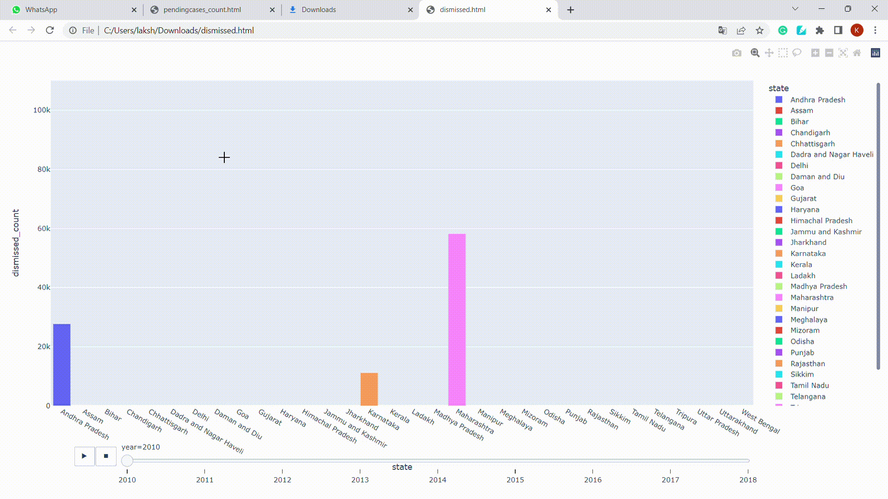
<a href="htmlpages/dismissed.html"> click here to see perfect view of this graph</a>

> change from 2010 to 2018

  


 Here red line represents dismissed cases andd blue line represents total cases in every year
In order to get clear information we need more appropriate way to show data so here is the visualized data iusing map.
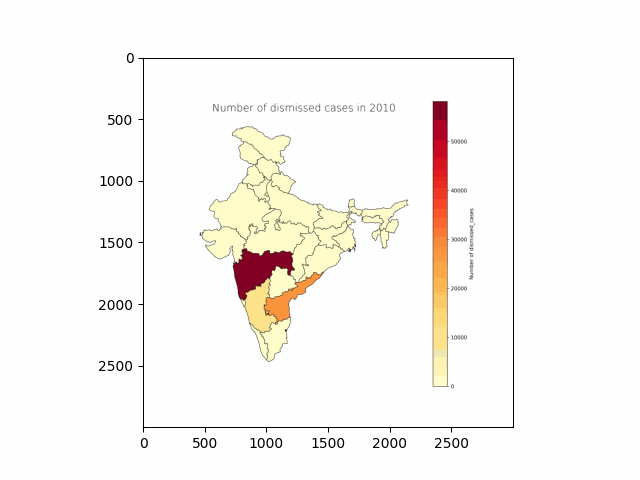

```
From this data we can see dismissed cases count has enormously increased in 2013 but by the end of 2018 it decreased.
```

## <u> Withdrawal cases </u>

In india because of various reasons people withdrawing cases after filing reasons like compromise between petitioner and defendent or other reasons.
Here we have data how this withdrawing cases has changed from 2010 to 2018
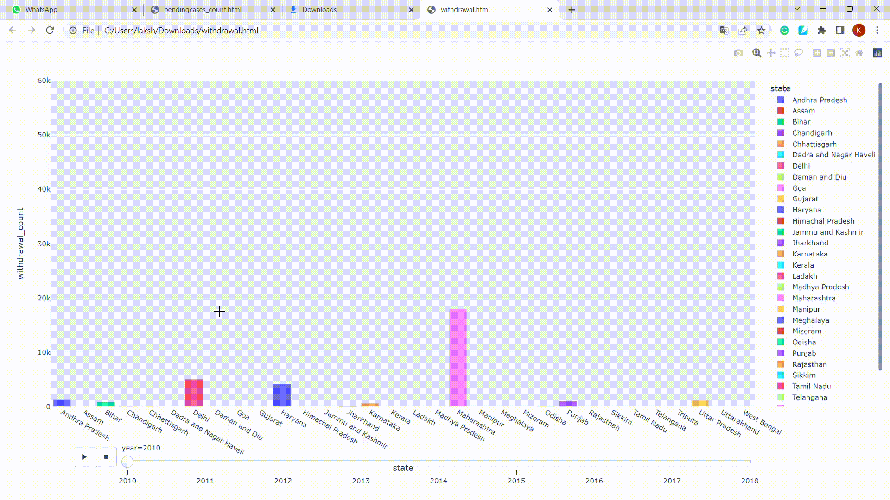

<a href="withdrawal.html"> click here to get better view in webpage</a>

> How its changing from 2010 to 2018.....


Here red line represents dismissed cases andd blue line represents total cases in every year

In order to get clear information we need more appropriate way to show data so here is the visualized data using map.

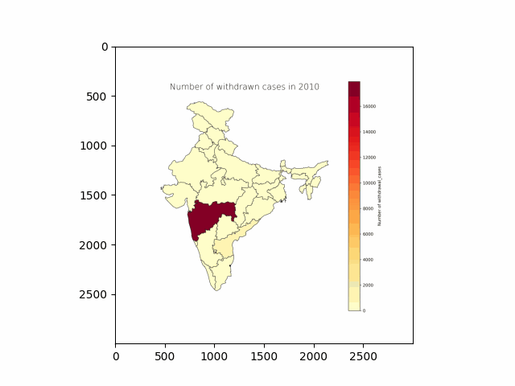

```
 From these graphs we can see that in 2013 there are high range of withdrawal cases so might be there a one reason for this may be political issues or other type of issues in society and family
```

## <u> Criminal cases </u>

In judiciary system there are various type of cases one of them is criminal cases, In this datset there are 65 million criminal cases according to data developement lab report.
So, now lets see criminal cases increased or decreased every year from 2010 to 2018
Here is the html animated representation you can go through this link to get more clearer picture <a href="htmlpages/criminal.html">click here.</a>

>How it is changing from 2010 to 2018 when compared to year and total cases in every year


Here blue line represents total cases and red line represents criminal cases


To get the more clearer view of this criminal cases representation here iam giving map data from 2010 to 2018


```
From these graph we can assume that in earlier days means till 2011 most of the cases are criminal cases but later there are many type of cases like divorce cases,land cases, family cases etcc..
```
## <u>**Prison cases**</u>

Every year in total cases there are many people going to prison as their final judgment because of severe cases. SO lets see how many cases have final judgemnt have prison as 1year or 2years etc..

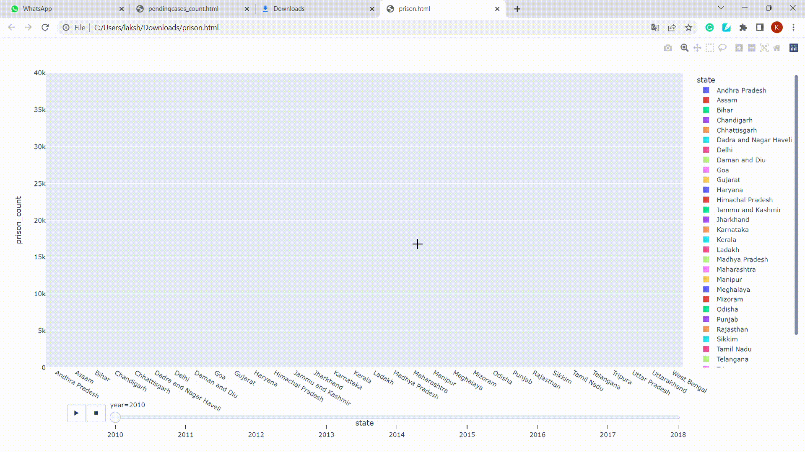

To get the more clearer picture of this page <a href="htmlpages/prison.html"> click here</a>

Lets see total number of cases vs every year and see how it is varying year by year.


Here blue line represents total cases and red line represnts prison cases 

To get the more closer view by visualisation i used map plotting from 2010 to 2018

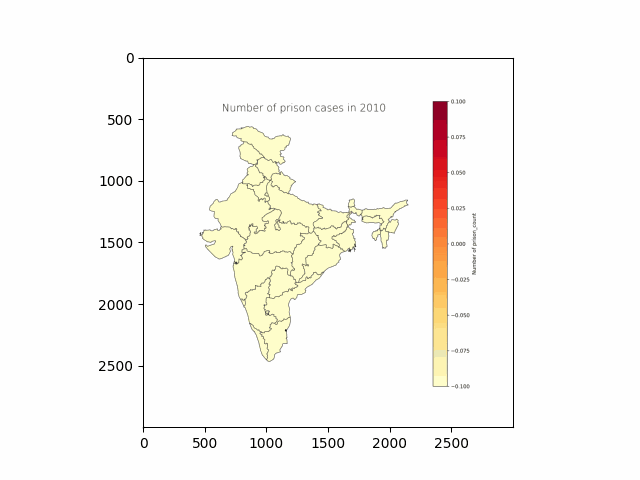

```
 From these visualizations we can say that when compared to the total cases prison judgemnet cases are lower but rapidly increased prison cases in 2016  and 2017 when compared to the previous years but slightly decreased in 2018 when compared to the 2017 may be this is becuase of some awarness among the people about driving, drinking or other type of normal cases. If these awarness increases then atleast 10% small type of cases will decreases
 ```

 ## <u><b>Pending cases</b></u>

 In any country , in any state pending cases are common in any court. Pending cases will raise due to increased number of cases or lack of evidence or judges/ client not availbale to each other to deal the case or some financial issues.

 Now lets see how many pending cases in every state from 2010 to 2018 in every year.

 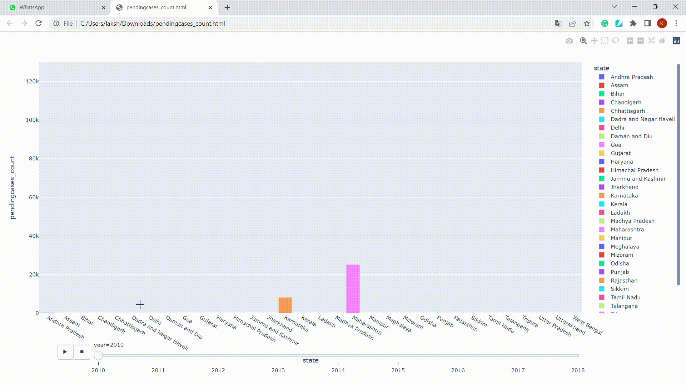

 Now lets see graph which tells about year and pending cases.. and also comparison with total cases in every year.

 
 

By luck indian judicial system working hard so very few cases are pending in every year now lets see which state having higher pending cases 

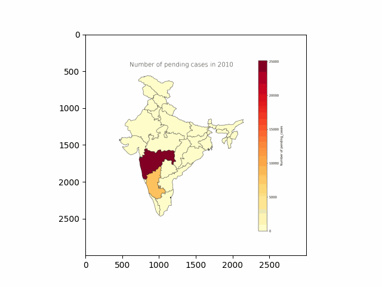


```
From these graph we can say that karnataka having higher number of pending cases. In the beginning maharashtra having higher pending cases but  later pending cases count have been decreased gradually.

But in 2017 there are huge number of pending cases but later it was enormous decreased by the end of 2018

```

## <u>**Total cases**</u>

Till now we have total pendingcases, withdrawn cases, criminal cases, dismissedcases now lets see total cases becuase it is very important to see total when comparing other values.


Now lets see how many cases in India every year from 2001 to 2018.

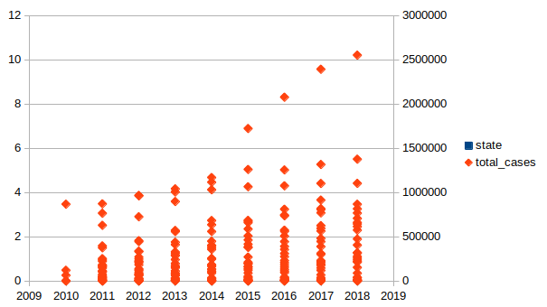

This graph represents total cases count in every year.

Now lets see relation pendingcases,withdrawn cases, criminal cases, dismissed cases when compared with the total cases.

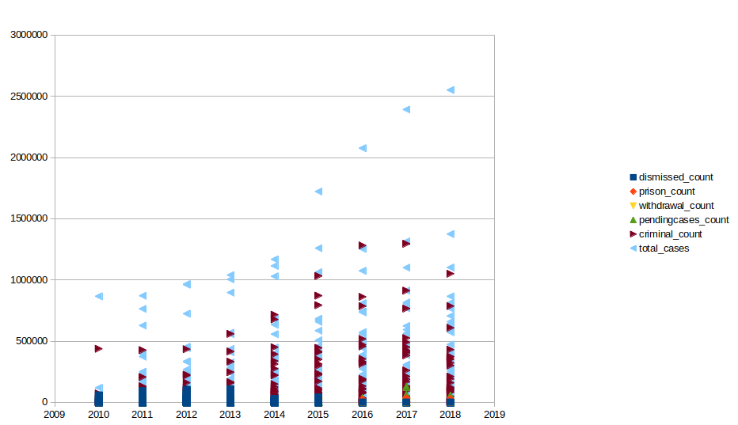

Now lets see count of pendingcases,withdrawn cases, criminal cases, dismissed cases when compared with the total cases using stcked bar.


Till now we have seen these grpah comparison with years from 2010 to 2018 now lets see each state every year in india from 2010 to 2018.

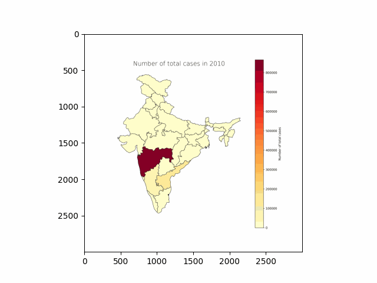

```
Finally total cases are incresing parlllely judges and other type of courts and cases are also increasing.

```
# <u>**Duration**</u>

Now lets move on to the duration of cases here i took three types of durations

1) Time taken to reach first hearing after filing.
2) Time taken to close the case after decision.
3) Time taken to completely close the file after filing.


## <u>Time taken to reach first hearing after filing:</u>
Here i divided time stages as 3 levels 
1) Average time for a case to reach court after filing
2) Minimum time to reach case after filing
3) Maximum time to reach case after filing
Here iam giving average number of days taken to get first hearing from court after filing the case in eqach state
<iframe title="Average time taken to reach court after filing in each state" aria-label="Bar Chart" id="datawrapper-chart-dVSRz" src="https://datawrapper.dwcdn.net/dVSRz/1/" scrolling="no" frameborder="0" style="width: 0; min-width: 100% !important; border: none;" height="832" data-external="1"></iframe><script type="text/javascript">!function(){"use strict";window.addEventListener("message",(function(e){if(void 0!==e.data["datawrapper-height"]){var t=document.querySelectorAll("iframe");for(var a in e.data["datawrapper-height"])for(var r=0;r<t.length;r++){if(t[r].contentWindow===e.source)t[r].style.height=e.data["datawrapper-height"][a]+"px"}}}))}();</script>
Here i give visulaization of minimum and maximum number of days to get first hearing for all type of cases after filing the cases in each state.
<iframe title="Minimum and maximum days for case to reach court after filing" aria-label="Split Bars" id="datawrapper-chart-aZfFm" src="https://datawrapper.dwcdn.net/aZfFm/1/" scrolling="no" frameborder="0" style="width: 0; min-width: 100% !important; border: none;" height="851" data-external="1"></iframe><script type="text/javascript">!function(){"use strict";window.addEventListener("message",(function(e){if(void 0!==e.data["datawrapper-height"]){var t=document.querySelectorAll("iframe");for(var a in e.data["datawrapper-height"])for(var r=0;r<t.length;r++){if(t[r].contentWindow===e.source)t[r].style.height=e.data["datawrapper-height"][a]+"px"}}}))}();
</script>

## <u>Time taken to close the case after decision:</u>
Here i divided time stages as 3 levels
1) AVerage time for a case to close after the judgement
2) Minimum time to close case after judgement 
3) Maximum time to close case after judgement 
In many f the states in india close the case within that day after the judgement but in somestates for some type of cases need to complete some actions like prison or divorce etcc
Here are the some states which will take more than 1 day to completely dispose the case after the judgement
<iframe title="Average days to dispose case after taking  decision" aria-label="Split Bars" id="datawrapper-chart-SY943" src="https://datawrapper.dwcdn.net/SY943/5/" scrolling="no" frameborder="0" style="width: 0; min-width: 100% !important; border: none;" height="537" data-external="1"></iframe><script type="text/javascript">!function(){"use strict";window.addEventListener("message",(function(e){if(void 0!==e.data["datawrapper-height"]){var t=document.querySelectorAll("iframe");for(var a in e.data["datawrapper-height"])for(var r=0;r<t.length;r++){if(t[r].contentWindow===e.source)t[r].style.height=e.data["datawrapper-height"][a]+"px"}}}))}();
</script>
Here i am giving minimum and maximum days to dispose case after the judgement
<iframe title="Minimum  and maximum days to dispose class after judgement" aria-label="Split Bars" id="datawrapper-chart-fNBRQ" src="https://datawrapper.dwcdn.net/fNBRQ/1/" scrolling="no" frameborder="0" style="width: 0; min-width: 100% !important; border: none;" height="851" data-external="1"></iframe><script type="text/javascript">!function(){"use strict";window.addEventListener("message",(function(e){if(void 0!==e.data["datawrapper-height"]){var t=document.querySelectorAll("iframe");for(var a in e.data["datawrapper-height"])for(var r=0;r<t.length;r++){if(t[r].contentWindow===e.source)t[r].style.height=e.data["datawrapper-height"][a]+"px"}}}))}();
</script>

## <u>Time taken to completely close the file after filing:</u>
Here i divided time stages as 3 levels
1) Average time to close case after filing means completion of case duration
2) MInimum time to complete case after filing
3) Maximum time to complete case after filing

Here iam giving average time it will take to complete the case
<iframe title="Average time taken to close file after filing in each state" aria-label="Bar Chart" id="datawrapper-chart-ma1mU" src="https://datawrapper.dwcdn.net/ma1mU/1/" scrolling="no" frameborder="0" style="width: 0; min-width: 100% !important; border: none;" height="909" data-external="1"></iframe><script type="text/javascript">!function(){"use strict";window.addEventListener("message",(function(e){if(void 0!==e.data["datawrapper-height"]){var t=document.querySelectorAll("iframe");for(var a in e.data["datawrapper-height"])for(var r=0;r<t.length;r++){if(t[r].contentWindow===e.source)t[r].style.height=e.data["datawrapper-height"][a]+"px"}}}))}();</script>

Here iam giving minimum and maximum days to complete case after filing in each state
<iframe title="Minimum and maximum days to complete case in each state" aria-label="Split Bars" id="datawrapper-chart-zCRSI" src="https://datawrapper.dwcdn.net/zCRSI/2/" scrolling="no" frameborder="0" style="width: 0; min-width: 100% !important; border: none;" height="880" data-external="1"></iframe><script type="text/javascript">!function(){"use strict";window.addEventListener("message",(function(e){if(void 0!==e.data["datawrapper-height"]){var t=document.querySelectorAll("iframe");for(var a in e.data["datawrapper-height"])for(var r=0;r<t.length;r++){if(t[r].contentWindow===e.source)t[r].style.height=e.data["datawrapper-height"][a]+"px"}}}))}();</script>

If we see the final version of analysis we get an idea how this is related to population
1) States with higher population in 2010 having high pending cases and criminal cases and also have taking many days to complete case but in 2018 states with higher population going to manage judicial system like constructing new courts and increasing judges this means judicial system getting enormous developemnt as comparede to the previous years.
2) States with lower population initially have just few cases and zero number of pending cases but after few years from 2010 to 2018 small states having high pending cases and having high duration for solving cases because of lack of judges and courts.
3) In 2010 cases other than criminal are very low but after some years many types of cases are highly increased like land cases, family cases, money issues has higly increased compared to the previous years from 2010 to 2018. It implies there is a huge change in people from 2010 to 2018. All are going to know about fundamental rights and judicial systems
4) At the begining of 2010 criminal cases take more than 5 years to solve but after developememt in technology and judicial system avergae time decreased to approximately 3 years but for the cases which were not handling correctly by judges they are going to take many years more than our imagination. Some cases are closing without any decision because of lack of judges.
